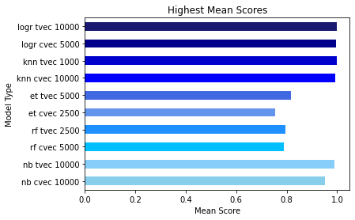

# Burton Snowboards:
## Snowboarding vs. Skiing: Should Burton Enter the Ski Market?

---

## Problem Statement

Burton Snowboards is considering entering the ski market.  In order to find out if they should enter the ski market, Burton Snowboards has brought me on to find out how similar skiers are to snowboarding.  I looked at comment data on how skiers and snowboarders talk about their respective sport, as well as their sentiment about being on the mountain in order to find out if skiers could be marketed to in similar ways that Burton is to snowboarders.

---

## Executive Summary
To find out if skiers could be marketed to using similar methods that Burton does for snowboarders, I looked at the subreddits for snowboarding and skiing to analyze the speech of snowboarders and skiers.  I pulled 20,000 comments total (10,000 comments from each subreddit) to make this analysis using pushshift API.  After cleaning and removing duplicate comments, there were 18,992 comments remaining.  Finally, I created classification models and ran sentiment analysis on each comment. 

---

## Data Dictionary
|Feature|Type|Dataset|Description|
|-----------------|-----------------|-----------------|-----------------|
|**Snowboarding Comments**|*string*|pushshift API/Reddit|Comments from the Snowboarding subreddit| 
|**Skiing Comments**|*string*|pushshift API/Reddit|Comments from the skiing subreddit|  

---

## Methodology

To begin, I pulled the comments of their respective subreddits using the pushshift API.  I then removed punctuation, as well as removed all stopwords and words uniquely related to skiing or snowboarding so that the classification models couldn't easily classify the comments based on obvious words.  I then removed comments/rows that only had one letter remaining for the comment.  To finish cleaning the comment data, I stemmed all of the comments using PorterStemmer.  Upon completion of cleaning the text data, I created multiple dataframes containing 5,000, 2,500, and 1,000 comments from both subreddits to run the models on.

After cleaning the data, I looked at the top words that showed up in both subreddits and found that many of the top words used in the skiing subreddit were also the top words used in the snowboarding subreddit.  I then compared the the sentiment of the comments using nltk's SentimentIntensityAnalyzer with a few tweaks to improve the accuracy of the analysis.

After completeing my EDA, classification models were created using Naive Bayes, Random Forest, Extra Trees, KNeighbors, and LogisticRegression, paired with both CountVectorizer and TFIDF transformers.  I then looked at the coefficients of these models to ensure that there were no coeficients that were dead givaways.  If there were any, I added them to the stopword list and reran everything.

Finally, I compared the models to see which garnered the best results and looked at the classification metrics of my model (Accuracy, Misclassification Rate, Precision, Recall and Specificity).
    
---

## Data Analysis and Findings
### Top Scores for Each Model
The top model created was a LogisticRegression Model using the TFIDF transformer using 10,000 comments.

  

### Classification Metrics of Top Model (LogisticRegression w/ TFIDF):
Accuracy: 0.9995\
Misclassification Rate: 0.0005\
Precision: 1.0\
Recall: 0.998\
Specificity: 1.0

**Confusion Matrix of Top Model (LogisticRegression w/ TFIDF)**

    

    
### Top Words:
The graphs below show how skier's and snowboarder's both use very similar verbiage when talking about their respective sport.

**Skier's Top Words**

    

**Snowboarder's Top Words**

    

### Sentiment Analysis:
As can be seen below, skier's and snowboarder's both have extremely similar sentiments pertaining to their respective sport.

**Skier's Sentiment when talking about Skiing:**

    

**Snowboarder's Sentiment when talking about Snowboarding:**

    

---

## Conclusions

Burton should move into the ski market because the would be able to use similar marketing campaigns for skiers that they use for snowboarders.  This is because skier's and snowboarder's use similar language when talking about their sport, as well as having nearly the same sentiments about them as well.

By using their reputation as the most popular and successfull snowboarding company in the world, they shouldn't have an issue breaking into the market and create new lines of revenue, as well as gaining new customers.

---

## Sources:
https://www.reddit.com/r/snowboarding/ \
https://www.reddit.com/r/skiing/ \
http://api.pushshift.io/reddit/comment/search/?subreddit=